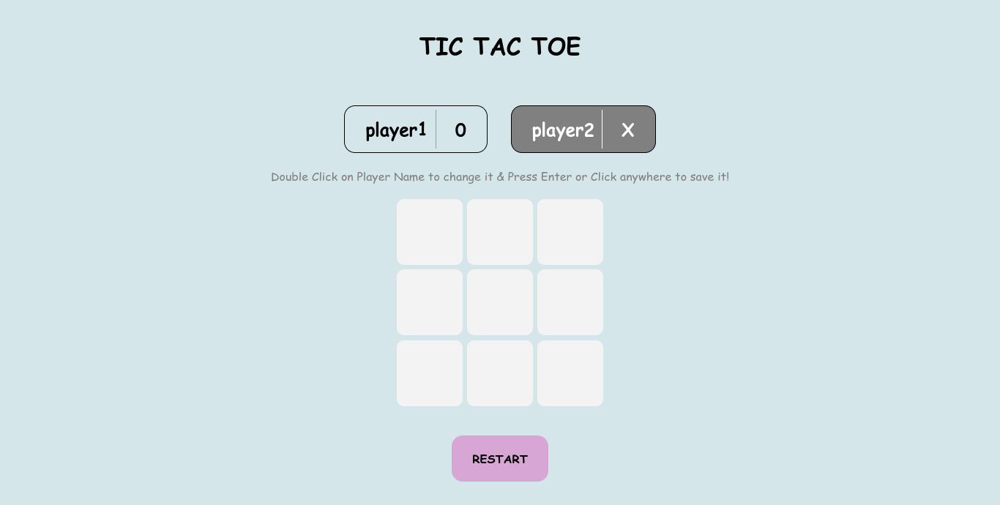

# tic-tac-toe

https://nerdyblock.github.io/tic-tac-toe/

Simple Tic Tac Toe project from odin project [curriculum](https://www.theodinproject.com/lessons/node-path-javascript-tic-tac-toe)  
Live version is [here](https://nerdyblock.github.io/tic-tac-toe/
)  

## features
- Player vs Player tic tac toe
- Change name by doublue clicking on player name
- restart button

